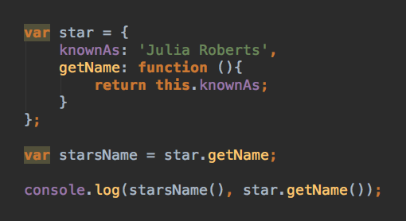

### Looking at the code below, what is the console log you would get (25%) and why (75%):

(Please view the rendered image below on github.com, not in vscode)



```
1. undefined undefined
1. undefined 'Julia Roberts'
1. 'Julia Roberts' 'Julia Roberts'
1. 'Julia Roberts' undefined
```

### Answer:
1. undefined 'Julia Roberts'

** Objects are a collection of key/value pairs that consist of properties and methods.
   starsName isnt a function.
   The right Object.method was not used for starsName that was trying to get a value from the star Object and it came out undifined.  Fixed by doing this

   var starsName = Object.keys(star).map(function(e){
    return star[e]
})

Object.keys() creates an array containing the keys of an object and can be used to iterate through the keys and values of an Object.

star.getName works because getName is with in the star Object, and .getName is the right key to get the value. **

