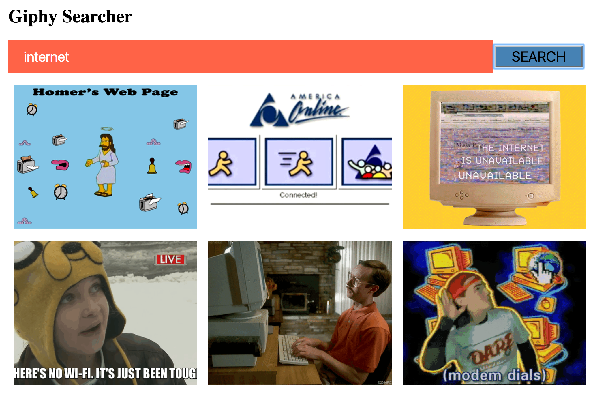

# Final Exam Project

In this section you have 2 choices.  **Do one of these, not both.**  

# Choice B: Re-create Giphy with its Own API - Front-end App

### Objective: 

Create a web app which uses a search input and Giphy’s API to display giphs on a page. You may use jQuery or Vanilla JS EJS, or React.

Here's my version (not awesome but will do)

Use the Giphy keyless API here ... https://developers.giphy.com/

Using their API build a small web app which does the following:

1. displays trending gifs on app load shown in a column/grid
2. has an input which allows you to search for specific gifs
3. Display only a manageable number of giphs.

3. Nice to have feature: at the bottom of the results, there is a ‘load more’ button, which gets more gifs using that same search term.