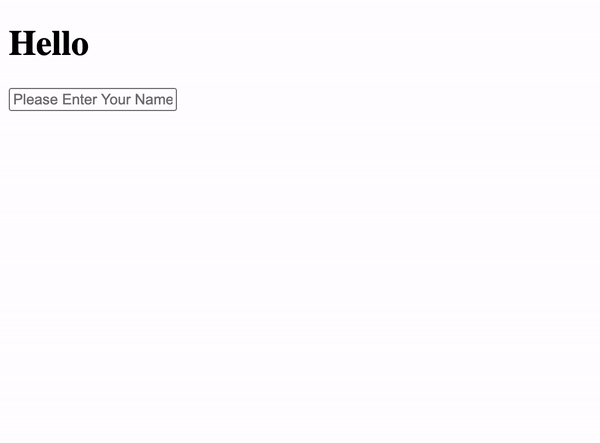

Included in this folder is a standard Create-React-App. With 2 
components, the first is the `Parent.js` component with a state of it's own called "name"
and in its JSX it renders that specific state variable within the h1 "Hello {name}". And below that it renders the "Child" component. In the Child component `Child.js` it has an input field that receives the text from the user. Your job is to pass the data from the input field in the child component back to the parent component. 

It should work like this when done:

### Feedback

You should create a function in the Parent that changes the state based on an input
value. 

Then create another function in the Child which calls the this.props.functionName from
the Parent, passing in the event.target.value.

This doesn't work or come close.